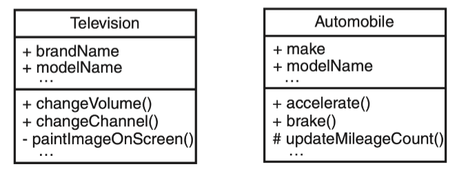

# Ch5-System Modeling
## Class Diagram
Class diagram is a type of static structure diagram that **describes the structure of a system** by showing the system’s:
- classes
- their attributes
- operations
- relationships among objects.
### Class Notation
- Class name (*mandatory*)
- Class attributes (*optional*)
    - Attribute是类的一个属性。 它描述了该属性在该类对象中可能持有的值的范围
    - 一个类可以有0或多个Attribute
- Class operations (*optional*)
    - Operation是类可以做的事情，因此也是你（或其他类）可以要求类做的事
    - 返回类型在冒号后

### Visibility of Class Attributes and Operations

| Access Right               | public (+) | private (-) | protected (#) |
| -------------------------- | ---------- | ----------- | ------------- |
| Members of the same class  | yes        | yes         | yes           |
| Members of derived classes | yes        | no          | yes           |
| Members of any other class | yes        | no          | no            |

### Finding Classes
根据stakeholders’ descriptions画类图：
- 注意名词，可能成为**Class**
- 注意动词，可能成为**Operation**
- 和成为类的名词有关的名词可能是**Attribute**

最好在一开始尽可能多的列出类：
- 发现多余时轻松删掉
- 明确的放弃比从没考虑要好、

### Selecting Classes
在选择类的时候丢弃以下几种：
- 超出了分析的范围
- 将系统作为一个整体
- 和其他类重复
- 太模糊或者太具体