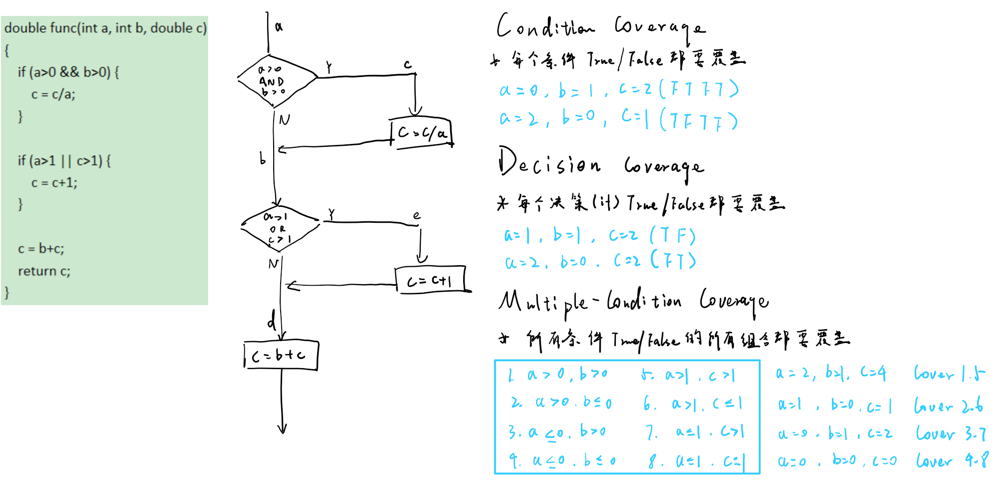

# Ch8-Software Testing
## Defect clustering vs Pesticide paradox
### Defect clustering (缺陷往往不均匀分)
- Small number of modules containing most of the defects.
### Pesticide paradox (杀虫剂悖论)
-If the same set of test cases are executed again and again over the period of time then these set of tests are not capable enough to identify new defects in the system.

## Static Testing vs Dynamic testing
### Static Testing
>静态测试指的是不执行程序代码的测试方式，通过检查软件的文档、代码、设计等来发现潜在的错误或缺陷。静态测试侧重于评估代码的质量、规范性以及是否符合预期标准。
### Dynamic testing
>动态测试指的是通过执行程序代码来检测软件的功能和行为。动态测试需要实际运行软件，并通过输入数据观察程序的输出，以验证软件的正确性、稳定性和性能。

- White box testing
- Black box testing

| **特性**            | **静态测试（Static Testing）**                   | **动态测试（Dynamic Testing）**                   |
|---------------------|-----------------------------------------------|------------------------------------------------|
| **定义**            | 不执行代码，检查代码或文档中的潜在问题         | 执行程序，检测程序在运行时的行为和错误         |
| **执行时机**        | 在开发的早期阶段，通常在编写代码或设计文档时  | 在软件开发的后期，通常是在开发完成后进行      |
| **测试方式**        | 代码审查、走查、静态分析等                    | 单元测试、集成测试、系统测试等                 |
| **测试目标**        | 代码规范、逻辑一致性、文档完整性等            | 功能实现、运行时错误、性能、安全等              |
| **优点**            | 早期发现缺陷、节省时间和成本、提高代码质量    | 发现运行时错误、验证功能和性能、涵盖更多场景   |
| **缺点**            | 无法发现运行时错误、依赖人工审查              | 需要资源、时间，可能延后问题发现              |
| **适用场景**        | 需求分析、设计阶段，代码审查                 | 开发完成后、验证软件功能、性能测试            |

## Black Box Testing vs White Box Testing
### White Box Testing
White box testing is software testing technique in which internal structure, design and coding of software are tested to verify flow of input-output and to improve design, usability and security.
- White box testing is concerned with the degree to w hich testcases exercise or cover the logic of the program.

**Control Flow Graph**

### Black box testing
Black box testing is a high level of testing that focuses on the behavior of the software. It involves testing from an external or end-user perspective.

黑盒开发测试用例，白盒补充测试用例
>The recommended procedure is to **develop test cases using the black box methods and then develop supplementary test cases with white box methods.**

| **特性**            | **黑盒测试（Black Box Testing）**                | **白盒测试（White Box Testing）**                |
|---------------------|-----------------------------------------------|------------------------------------------------|
| **定义**            | 基于软件需求和功能进行测试，不关注内部实现      | 基于程序内部结构和逻辑进行测试，关注代码实现   |
| **测试目标**        | 功能正确性、用户需求、界面表现等                | 程序结构、逻辑、路径覆盖、分支覆盖等            |
| **关注点**          | 输入输出的关系，不考虑程序的内部逻辑            | 程序内部的实现、代码结构和逻辑流程            |
| **测试人员**        | 测试人员不需要了解程序的源代码                  | 测试人员需要具备对程序代码的深入理解           |
| **测试方法**        | 功能测试、回归测试、系统测试、验收测试等        | 单元测试、集成测试、路径测试、覆盖测试等       |
| **优点**            | 易于理解、与用户需求更贴近，能够发现系统级错误  | 可以全面检查程序的每个路径、分支，帮助发现潜在的逻辑错误 |
| **缺点**            | 不能发现程序内部的逻辑错误，测试覆盖面有限      | 测试难度大，可能遗漏某些高层次的功能性问题     |
| **适用场景**        | 功能性测试、系统级别的验证测试                 | 安全性测试、代码优化、单元测试等               |

